# Neuro Spectrum

## Abstract

This project presents a complete spectral estimation study for a stable linear
time invariant IIR system driven by Gaussian white noise. The work is organized
as one consistent experiment: define the true system, generate filtered output
data, estimate autocorrelation, compare raw periodogram and Welch spectral
estimates, and then test whether learned neural generators can reproduce the
same second order behavior. The classical analysis uses the known system as the
reference point, so every plot and table is interpreted through impulse
response, autocorrelation, power spectrum, bias, and variance rather than as an
isolated numerical result.

The main finding is that the raw periodogram becomes better centered around the
true spectrum as record length grows, but it keeps high pointwise variability in
the resonant frequency regions. Welch averaging gives a smoother estimate by
averaging Hann windowed segments, which reduces variance while introducing
additional smoothing bias. The learned generation study shows the same
principle from a data driven angle: a lagged MLP acts like a finite impulse
response approximation to the IIR system and recovers the spectral shape and
impulse response closely, while the selected LSTM produces a lower power output
that misses the strongest resonant behavior. The README presents the method,
equations, visual evidence, metrics, and interpretation together so the
assignment reads as a technical report instead of a collection of outputs.

## Output Gallery

### System Overview

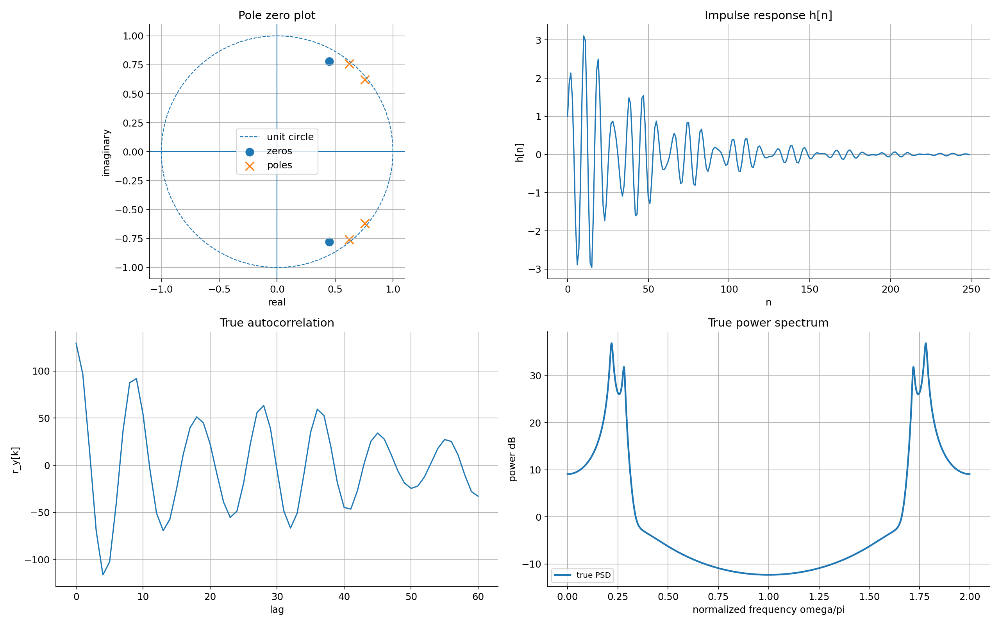

The system overview keeps the analytic reference in one panel: pole zero
geometry, impulse response, true autocorrelation, and true power spectrum. The
large PSD peaks come from poles close enough to the unit circle to create strong
resonant amplification. These reference curves are the targets used for all
later finite sample and learned estimates.

### Generated Realization

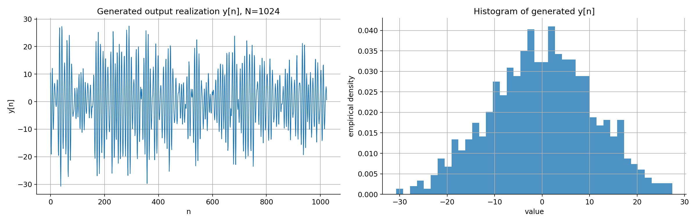

The generated output realization shows the time domain behavior of the filtered
white noise sequence. Even though the input is white and unit variance, the IIR
filter produces a strongly colored output with wide amplitude swings and a
non flat empirical distribution.

### Autocorrelation Estimates

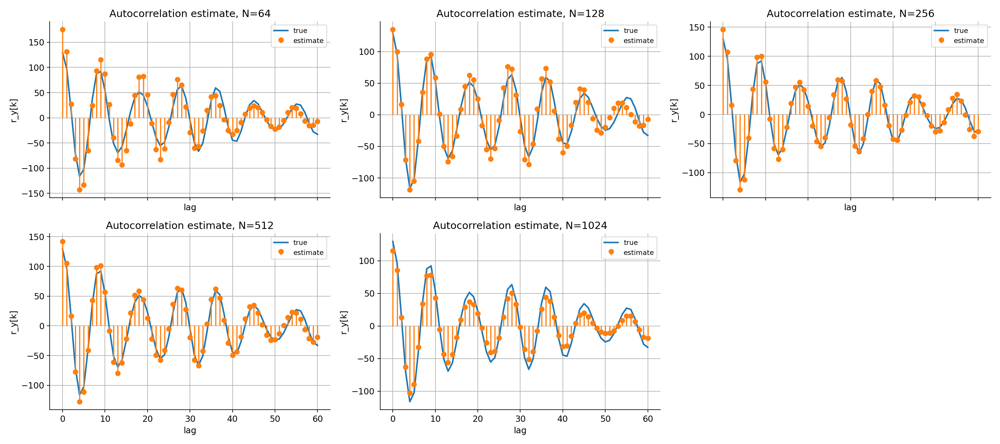

The autocorrelation grid compares the biased sample autocorrelation estimate
against the true autocorrelation for each data length. The short records follow
the broad oscillatory shape but have visible lag by lag error. Larger records
reduce much of the random deviation, although a single realization can still
over or under shoot the zero lag power.

### Raw Periodogram

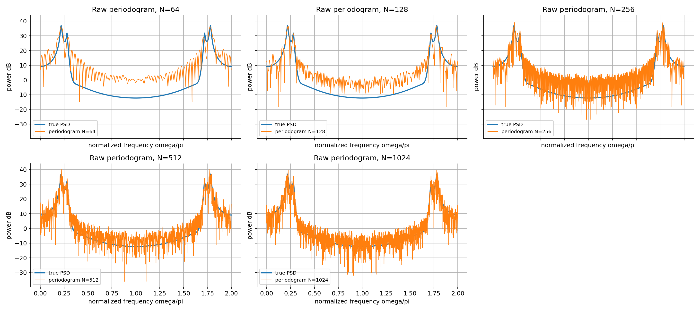

The raw periodogram grid shows the high variability of one realization spectral
estimates. Increasing `N` sharpens the resonant peaks and improves frequency
resolution, but the individual periodogram remains visually noisy because the
raw estimator is not a consistent pointwise variance estimator.

### Periodogram Mean And Variance

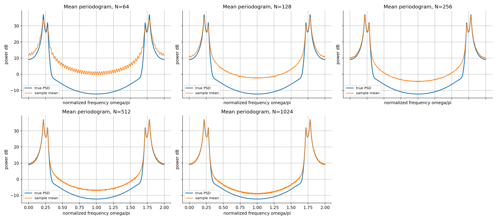

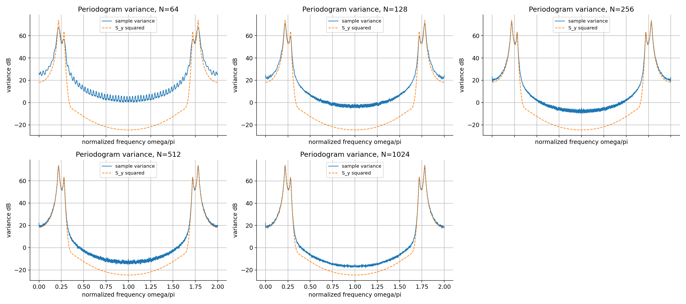

The Monte Carlo mean moves toward the true spectrum as the record length grows.
The variance panel shows the complementary behavior: even when the mean shape
is accurate, the variance remains large around high power frequency regions.
This is the expected raw periodogram behavior.

### Welch Estimates

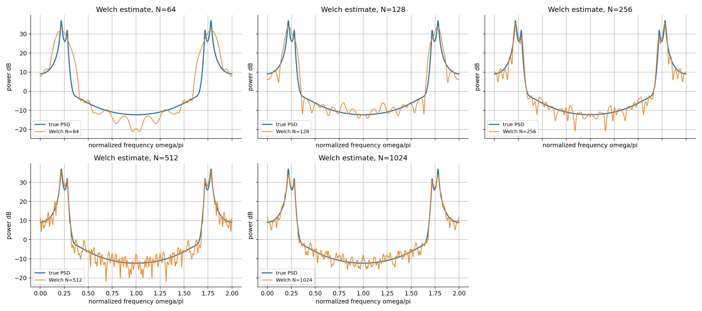

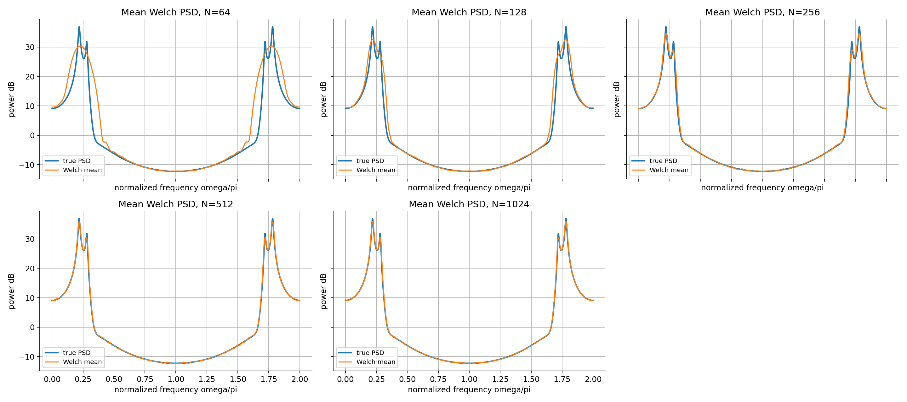

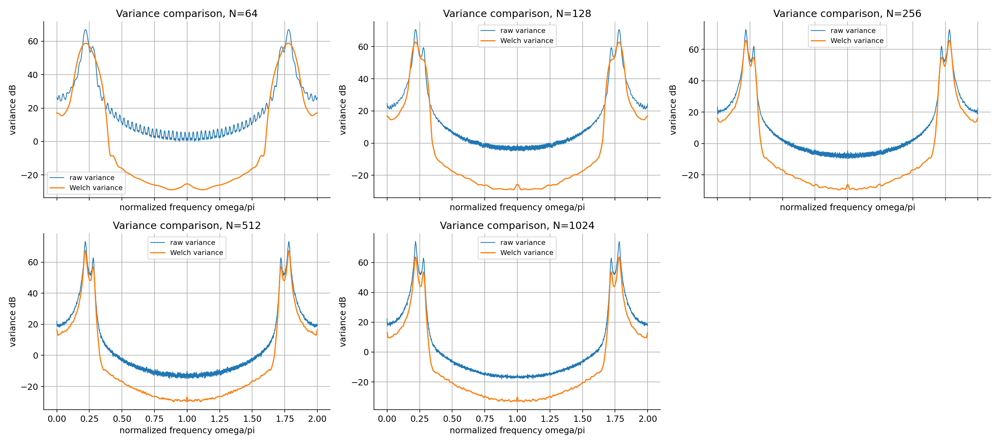

The Welch panels show the effect of segmenting the record, applying a Hann data
window, and averaging segment periodograms. The result is visibly smoother than
the raw periodogram and has lower Monte Carlo variance, especially for the
longest record. The price is bias from window smoothing and from using shorter
segments than the full record.

### Neural Configuration Search

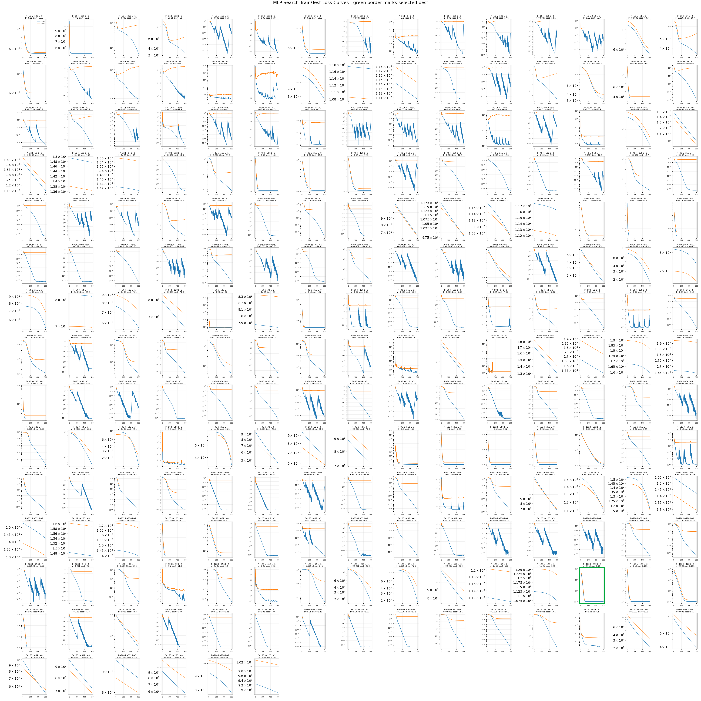

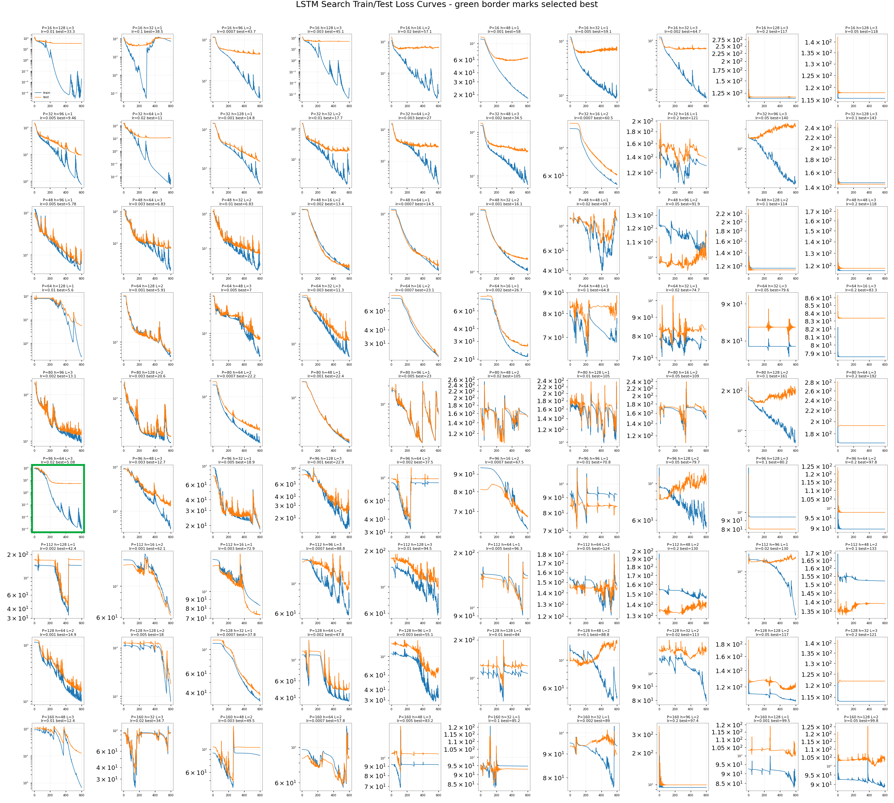

The search panels summarize the train/test loss histories used to select the
neural generators. The MLP search favors a long lag and a linear readout on the
lag window, which is consistent with the underlying IIR process being linear in
past input samples. The LSTM search finds a lower training loss in some runs,
but the saved selected LSTM generalizes worse than the MLP and later shows a
weaker recovered impulse response.

### Learned Spectral Evidence

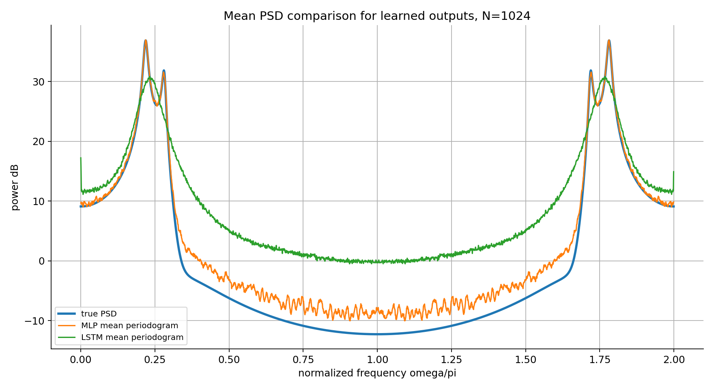

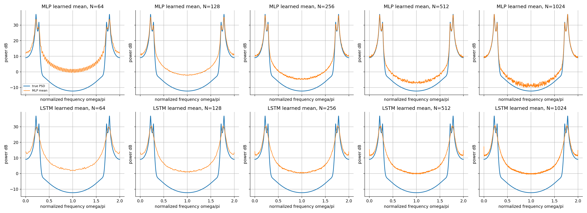

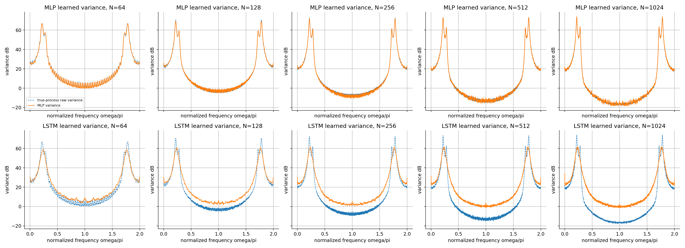

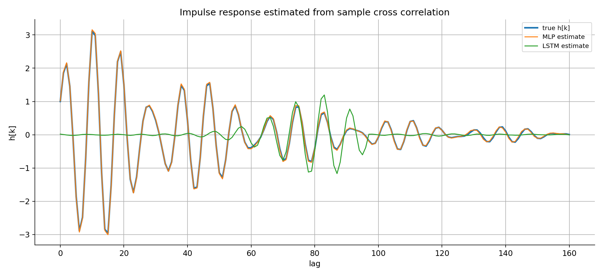

The learned output panels compare the neural generators against the same true
PSD and impulse response used in the classical part. The MLP tracks the true
spectral envelope closely, including the high gain resonant region. The LSTM
output has much lower average power and a much smaller impulse response
amplitude, so its spectrum is smoother and underestimates the dominant peaks.

## Setup

From the project root:

```bash
cd /mntdata/src/Neuro-Spectrum
pip install -r requirements.txt
```

Core dependencies:

- `numpy`
- `scipy`
- `matplotlib`
- `PyYAML`
- `torch`
- `pandas`
- `ipython`
- `jupyter`

## Data Layout

Input and configuration files:

```text
papers/
  NumericalAssignment 1.pdf
  Slides_Numerical_Assignment.pdf
configs/
  system_iir_process.yml
  classical_reference_process.yml
  classical_periodogram_monte_carlo.yml
  classical_welch_monte_carlo.yml
  welch_window_plan.yml
  neural_data_generation.yml
  neural_configuration_search.yml
  neural_mlp_training.yml
  neural_lstm_training.yml
  neural_inference_analysis.yml
notebooks/
  notebook.ipynb
```

Generated outputs:

```text
data/
  generated_processes/
    reference_process.npz
  neural_training/
    lag_*/
      x.npy
      y.npy
outputs/
  classical_spectral_estimation/
    autocorrelation_estimates.npz
    periodogram_statistics.npz
    welch_statistics.npz
  neural_spectral_estimation/
    selected_neural_configurations.json
    configuration_search/
    predictions/
    periodogram_statistics_*_lag_*.npz
    impulse_response_estimate_*_lag_*.npz
  models/
    simple_mlp_lag_160.pt
    simple_lstm_lag_96.pt
  figures/
    assignment_summary/
    neural_training_loss/
```

The generated arrays and figures are intentionally separated from the scripts.
The scripts read YAML configuration, write compressed numerical outputs, and
render static evidence panels. This makes the notebook and README explain
already saved results rather than recomputing them inside the document.

## System Model

### IIR Process

The assignment process is a white noise driven IIR system. The input sequence is

$$x[n] \sim \mathcal{N}(0,\sigma_x^2), \qquad \sigma_x^2 = 1,$$

and the output is generated by the transfer function

$$H(z) = \frac{B(z)}{A(z)} =
\frac{1 - 0.9z^{-1} + 0.81z^{-2}}
{1 - 2.76z^{-1} + 3.809z^{-2} - 2.654z^{-3} + 0.924z^{-4}}.$$

Equivalently, the recursive difference equation is

$$y[n] = \sum_{k=0}^{2} b_k x[n-k] - \sum_{\ell=1}^{4} a_\ell y[n-\ell].$$

The true power spectrum follows directly from the frequency response:

$$S_y(\omega) = \sigma_x^2 \left|H(e^{j\omega})\right|^2.$$

The true impulse response is obtained by filtering a unit impulse:

$$h[n] = \mathcal{Z}^{-1}\{H(z)\}.$$

Because the input is white, the output autocorrelation is the scaled
self correlation of the impulse response:

$$r_y[k] = \sigma_x^2 \sum_{m=0}^{\infty} h[m]h[m+k], \qquad k \ge 0.$$

### Reference Configuration

| Quantity | Value |
|---|---:|
| reference sample length | `1024` |
| FFT grid size | `2048` |
| burn in samples | `4096` |
| impulse response length | `4096` |
| autocorrelation max lag | `60` |
| classical Monte Carlo realizations | `500` |
| data lengths | `64, 128, 256, 512, 1024` |
| true zero lag autocorrelation | `129.4812` |
| true PSD mean over FFT grid | `129.4812` |
| true PSD maximum | `4907.6789` |

The equality between the zero lag autocorrelation and the average spectrum is a
useful consistency check: both measure output power, one in time and one in
frequency.

## Autocorrelation Estimation

### Estimator

For a finite record of length `N`, the biased sample autocorrelation estimate is

$$\hat{r}_y[k] = \frac{1}{N}\sum_{n=0}^{N-k-1} y[n]y[n+k],
\qquad 0 \le k < N.$$

The estimator uses the fixed denominator `N`, so the large lag values are
slightly shrunk relative to the unbiased version. That bias is usually accepted
in spectral estimation because the biased autocorrelation sequence is better
behaved when transformed into a PSD estimate.

### Current Metrics

The table reports the error between the estimated autocorrelation vector and
the true autocorrelation vector over the displayed lags. For a maximum lag `K`,
the root mean square error and mean absolute error are

$$\mathrm{RMSE}_r(N)=
\sqrt{\frac{1}{K+1}\sum_{k=0}^{K}
\left(\hat{r}_{y,N}[k]-r_y[k]\right)^2},$$

$$\mathrm{MAE}_r(N)=
\frac{1}{K+1}\sum_{k=0}^{K}
\left|\hat{r}_{y,N}[k]-r_y[k]\right|.$$

The zero lag entry is also reported because

$$r_y[0]=\mathbb{E}\{y^2[n]\}$$

is the total output power. If the zero lag estimate is too high or too low, the
estimated autocorrelation sequence is also misrepresenting the process energy.

| N | RMSE vs true autocorrelation | MAE vs true autocorrelation | estimated r_y[0] | true r_y[0] |
|---:|---:|---:|---:|---:|
| 64 | `20.1602` | `16.8190` | `175.2832` | `129.4812` |
| 128 | `12.7613` | `10.4246` | `134.8750` | `129.4812` |
| 256 | `7.4086` | `6.2073` | `145.8664` | `129.4812` |
| 512 | `9.0170` | `7.9891` | `142.0191` | `129.4812` |
| 1024 | `10.2916` | `9.2891` | `115.3337` | `129.4812` |

The best RMSE in this single reference realization occurs at `N = 256`, not at
the largest `N`. That does not contradict the estimator's large sample behavior:
these rows are computed from one realization, so random alignment between the
finite record and the oscillatory system response still matters. The main
visual conclusion is that the estimated shape stabilizes as more samples are
used, while the exact amplitude at individual lags remains realization
dependent.

## Raw Periodogram

### Estimator

For a length `N` record, the raw periodogram is

$$I_N(\omega) =
\frac{1}{N}\left|\sum_{n=0}^{N-1} y[n]e^{-j\omega n}\right|^2.$$

Its expectation is not exactly the true spectrum. It is the true spectrum
smoothed by the Fejer kernel:

$$\mathbb{E}\{I_N(\omega)\}
= \frac{1}{2\pi}\int_{-\pi}^{\pi} S_y(\lambda)
F_N(\omega-\lambda)\,d\lambda,$$

where

$$F_N(\theta)=\frac{1}{N}
\left|\frac{\sin(N\theta/2)}{\sin(\theta/2)}\right|^2.$$

This is the Bartlett or Fejer theoretical smoothing window associated with
truncating the autocorrelation sequence. It is separate from the Hann data
window used later by Welch's method.

The important variance behavior is

$$\mathrm{var}\{I_N(\omega)\} \approx S_y(\omega)^2,$$

away from special frequencies. Therefore the raw periodogram becomes less
biased with more data but does not become a low variance pointwise estimator by
itself.

### Monte Carlo Results

For `M` Monte Carlo realizations, the sample mean periodogram is

$$\bar{I}_N(\omega_j)=\frac{1}{M}\sum_{m=1}^{M}I_N^{(m)}(\omega_j),$$

and the sample variance is

$$\widehat{\mathrm{var}}\{I_N(\omega_j)\}=
\frac{1}{M-1}\sum_{m=1}^{M}
\left(I_N^{(m)}(\omega_j)-\bar{I}_N(\omega_j)\right)^2.$$

The table uses a relative spectral error to compare the Monte Carlo mean to the
true spectrum across the full FFT grid:

$$\epsilon_{\mathrm{PSD}}(N)=
\frac{\left\|\bar{I}_N-S_y\right\|_2}{\left\|S_y\right\|_2}.$$

The average variance is the grid average

$$\bar{v}_N=\frac{1}{J}\sum_{j=0}^{J-1}
\widehat{\mathrm{var}}\{I_N(\omega_j)\}.$$

| N | mean relative L2 error | average variance | peak of Monte Carlo mean |
|---:|---:|---:|---:|
| 64 | `0.4350` | `152344.49` | `2310.70` |
| 128 | `0.2410` | `229059.24` | `3376.77` |
| 256 | `0.1090` | `255282.26` | `4178.58` |
| 512 | `0.0520` | `277375.52` | `4683.91` |
| 1024 | `0.0482` | `282703.13` | `4768.79` |

The mean relative error decreases strongly with `N`, which means the Monte
Carlo average is approaching the true spectrum. At the same time, the average
variance remains very large because the true process has high power spectral
peaks. This is why the raw periodogram is useful for locating spectral energy
but unreliable as a smooth estimate from one record.

## Welch Spectral Estimation

### Estimator

Welch's method divides a record into overlapping segments, multiplies each
segment by a data window, computes a modified periodogram for each segment, and
averages the segment estimates. For segment length `M`, overlap `D`, and step
`R = M-D`, segment `q` is

$$y_q[n] = y[qR+n]w[n], \qquad 0 \le n < M.$$

The modified segment periodogram is normalized by the window energy:

$$I_q^{(w)}(\omega) =
\frac{1}{\sum_{n=0}^{M-1}w^2[n]}
\left|\sum_{n=0}^{M-1} y[qR+n]w[n]e^{-j\omega n}\right|^2.$$

The Welch estimate is then

$$\hat{S}_{W}(\omega)=\frac{1}{K}\sum_{q=0}^{K-1}I_q^{(w)}(\omega).$$

This run uses the Hann window

$$w[n]=\frac{1}{2}\left(1-\cos\frac{2\pi n}{M-1}\right).$$

### Welch Plan

The segment starts are

$$s_q=q(M-D), \qquad q=0,1,\ldots,K-1,$$

where `M` is segment length and `D` is overlap. The number of segments that fit
inside a record of length `N` is

$$K=1+\left\lfloor\frac{N-M}{M-D}\right\rfloor.$$

The overlap increases the number of averaged periodograms without requiring
more data, while the Hann window reduces leakage from the strong resonant
peaks.

| N | segment length | overlap | window |
|---:|---:|---:|---|
| 64 | `32` | `16` | `hann` |
| 128 | `64` | `32` | `hann` |
| 256 | `128` | `64` | `hann` |
| 512 | `256` | `128` | `hann` |
| 1024 | `256` | `128` | `hann` |

### Monte Carlo Results

The Welch variance reduction in the last column is computed from the average
grid variances:

$$\mathrm{Reduction}(N)=
\left(1-\frac{\bar{v}_{W,N}}{\bar{v}_{P,N}}\right)\times 100\%,$$

where `v_W,N` is the Welch average variance and `v_P,N` is the raw periodogram
average variance for the same record length. A positive value means Welch is
less variable on average over the frequency grid.

| N | Welch mean relative L2 error | Welch average variance | raw average variance | variance reduction |
|---:|---:|---:|---:|---:|
| 64 | `0.7135` | `59981.10` | `152344.49` | `60.63%` |
| 128 | `0.5637` | `79633.99` | `229059.24` | `65.23%` |
| 256 | `0.3452` | `88104.05` | `255282.26` | `65.49%` |
| 512 | `0.1643` | `89467.61` | `277375.52` | `67.74%` |
| 1024 | `0.1564` | `39679.24` | `282703.13` | `85.96%` |

Welch averaging gives the expected variance reduction. The reduction is largest
for `N = 1024` because that record supports multiple Hann windowed segments of
length `256`, so averaging is effective while still retaining enough frequency
resolution. The higher mean relative error compared with the raw periodogram is
also expected: Welch trades bias for variance reduction by smoothing with the
data window and by using shorter segment lengths.

## Neural Process Generation

### Lagged Supervised Formulation

The neural models learn the input output map of the IIR system from aligned
training pairs. For a lag value `P`, the stored input has length `N+P` and the
target output has length `N`. The feature vector for output sample `y[n]` is

$$\phi_P[n] =
[x[n+P], x[n+P-1], \ldots, x[n]] \in \mathbb{R}^{P+1}.$$

The supervised objective is

$$\min_\theta \frac{1}{N}\sum_{n=0}^{N-1}
\left(f_\theta(\phi_P[n]) - y[n]\right)^2.$$

For the MLP, the model is a feedforward map from the lag vector to one scalar:

$$\hat{y}[n] = W_L \rho(W_{L-1}\rho(\cdots \rho(W_1\phi_P[n]))).$$

When the selected MLP uses zero hidden layers, this reduces to a linear FIR like
readout over the lag window:

$$\hat{y}[n] = \beta^\top \phi_P[n] + b.$$

For the LSTM, the same lag vector is interpreted as a short sequence of scalar
inputs. The final hidden state is mapped to the predicted output:

$$h_0,\ldots,h_P = \mathrm{LSTM}(x[n+P],x[n+P-1],\ldots,x[n]),$$

$$\hat{y}[n] = c^\top h_P + d.$$

### Search Configuration

The search uses lag values

```text
16, 32, 48, 64, 80, 96, 112, 128, 160
```

and trains candidate models for `600` epochs during search. A deterministic
trial limiter samples the larger hyperparameter grid, giving `216` completed
MLP trials and `90` completed LSTM trials.

Each candidate configuration `c` is trained on a train split and measured on a
held out split with mean squared error

$$\mathrm{MSE}_{\mathrm{test}}(c)=
\frac{1}{|\mathcal{T}|}\sum_{n\in\mathcal{T}}
\left(f_{\theta_c}(\phi_P[n])-y[n]\right)^2.$$

The selected configuration for each model family is the one with the smallest
saved test loss:

$$c^\star=\arg\min_c \mathrm{MSE}_{\mathrm{test}}(c).$$

### Best Search Result By Lag

The lag table reports the best candidate found at each lag value before the
final selected model is trained again. This separates two questions: which lag
contains enough input history, and which architecture learns that history
without overfitting.

| model | lag | best test MSE | selected hyperparameters |
|---|---:|---:|---|
| MLP | 16 | `53.58` | `hidden=128`, `layers=0`, `lr=0.02` |
| MLP | 32 | `38.49` | `hidden=512`, `layers=1`, `lr=0.005` |
| MLP | 48 | `11.58` | `hidden=512`, `layers=2`, `lr=0.0007` |
| MLP | 64 | `6.062` | `hidden=32`, `layers=0`, `lr=0.02` |
| MLP | 80 | `4.921` | `hidden=256`, `layers=0`, `lr=0.1` |
| MLP | 96 | `2.244` | `hidden=256`, `layers=0`, `lr=0.2` |
| MLP | 112 | `1.320` | `hidden=256`, `layers=0`, `lr=0.2` |
| MLP | 128 | `0.6623` | `hidden=128`, `layers=0`, `lr=0.2` |
| MLP | 160 | `0.1542` | `hidden=512`, `layers=0`, `lr=0.05` |
| LSTM | 16 | `33.32` | `hidden=128`, `layers=3`, `lr=0.01` |
| LSTM | 32 | `9.458` | `hidden=96`, `layers=1`, `lr=0.005` |
| LSTM | 48 | `5.779` | `hidden=96`, `layers=1`, `lr=0.005` |
| LSTM | 64 | `5.603` | `hidden=128`, `layers=1`, `lr=0.01` |
| LSTM | 80 | `13.10` | `hidden=96`, `layers=3`, `lr=0.002` |
| LSTM | 96 | `5.077` | `hidden=64`, `layers=3`, `lr=0.02` |
| LSTM | 112 | `42.35` | `hidden=128`, `layers=1`, `lr=0.002` |
| LSTM | 128 | `14.93` | `hidden=64`, `layers=2`, `lr=0.001` |
| LSTM | 160 | `12.38` | `hidden=48`, `layers=3`, `lr=0.01` |

The MLP results improve steadily as the lag grows. That is physically
meaningful: a longer lag window captures more of the IIR impulse response tail.
The selected MLP is effectively a learned finite impulse response approximation
to the true IIR system. The LSTM results are less monotone, indicating that the
sequence model is harder to tune for this small supervised dataset and does not
benefit as directly from the longer lag windows.

### Selected Training Runs

After search, the selected configurations are trained for the longer selected
training run. The saved checkpoint is taken from the epoch with the smallest
validation loss:

$$e^\star=\arg\min_e \mathrm{MSE}_{\mathrm{test}}(e).$$

This matters because the final epoch is not always the best generalizing epoch,
especially for the LSTM where the training loss continues to become very small
while the test loss is much larger.

| model | lag | architecture | learning rate | saved epoch | saved test MSE | final train MSE | final test MSE |
|---|---:|---|---:|---:|---:|---:|---:|
| MLP | `160` | `hidden=512`, `num_hidden_layers=0` | `0.05` | `133` | `0.154234` | `0.110952` | `0.154741` |
| LSTM | `96` | `hidden=64`, `num_layers=3` | `0.02` | `442` | `5.077400` | `0.000108` | `5.414616` |

The MLP has both low train error and low test error, so it learns a stable
input output map. The LSTM reaches an extremely small training error but much
higher test error, which signals overfitting or a learned mapping that does not
generalize as well to new white noise realizations.

## Learned Periodogram Analysis

### Evaluation Procedure

After training, each selected neural model receives new white noise input
realizations. For each model specific lag `P`, the input length is `1024+P`, and
the model predicts `1024` output samples per realization. The same periodogram
statistics used for the true IIR process are then applied to these learned
outputs.

The comparison is strict because the learned process is not judged by training
loss alone. It must reproduce:

- the mean PSD envelope,
- the periodogram variance pattern,
- the average process power,
- and the impulse response implied by input output cross correlation.

### Learned PSD Metrics

For learned output realizations, the same Monte Carlo periodogram machinery is
used. If model `g` produces predictions

$$\hat{y}^{(m)}_g[n]=g(\phi_P^{(m)}[n]),$$

then its learned process periodogram is

$$\hat{I}^{(m)}_{g,N}(\omega)=
\frac{1}{N}\left|\sum_{n=0}^{N-1}
\hat{y}^{(m)}_g[n]e^{-j\omega n}\right|^2.$$

The learned mean spectrum and learned variance are computed by averaging these
periodograms over the generated realizations:

$$\bar{I}_{g,N}(\omega)=
\frac{1}{M}\sum_{m=1}^{M}\hat{I}^{(m)}_{g,N}(\omega).$$

The mean PSD power column is the grid average of `I_g,N`. It should be close to
`r_y[0]` when the learned process has the correct output energy.

| model | N | mean relative L2 error | average variance | mean PSD power |
|---|---:|---:|---:|---:|
| MLP lag 160 | 64 | `0.4326` | `150032.83` | `130.83` |
| MLP lag 160 | 128 | `0.2613` | `188190.94` | `130.28` |
| MLP lag 160 | 256 | `0.1232` | `241730.89` | `133.94` |
| MLP lag 160 | 512 | `0.0744` | `277399.35` | `133.21` |
| MLP lag 160 | 1024 | `0.0564` | `295972.44` | `132.40` |
| LSTM lag 96 | 64 | `0.7536` | `38539.18` | `83.62` |
| LSTM lag 96 | 128 | `0.7436` | `48638.01` | `83.76` |
| LSTM lag 96 | 256 | `0.7339` | `53390.97` | `83.28` |
| LSTM lag 96 | 512 | `0.7329` | `54778.44` | `83.11` |
| LSTM lag 96 | 1024 | `0.7274` | `57398.13` | `83.77` |

The true average PSD power is `129.4812`. The MLP learned process stays close
to that value across all record lengths. Its `N = 1024` mean relative L2 error
is `0.0564`, close to the raw true process Monte Carlo value of `0.0482`. The
LSTM learned process has much lower mean power, around `83.7`, and a much
higher spectral error. Its lower variance is therefore not automatically a
better result: it is partly lower because the generated process itself is
under powered.

## Learned Impulse Response

### Cross Correlation Estimate

For white input, the impulse response can be estimated from input output
cross correlation:

$$h[k] = \frac{\mathbb{E}\{y[n]x[n-k]\}}{\sigma_x^2}.$$

The finite sample learned output estimate uses the generated input
realizations and predictions:

$$\hat{h}[k] =
\frac{1}{\sigma_x^2}
\frac{1}{|\mathcal{I}_k|}
\sum_{(b,n)\in\mathcal{I}_k} \hat{y}_b[n]x_b[n+P-k],$$

where `P` is the model lag and the valid index set `I_k` keeps only pairs whose
input sample exists in the stored pre history.

### Current Metrics

The impulse response table uses the same error definitions as the
autocorrelation section, now applied to the true and estimated impulse response
vectors. It also reports the Pearson correlation

$$\rho_h=
\frac{\sum_k(\hat{h}[k]-\bar{\hat{h}})(h[k]-\bar{h})}
{\sqrt{\sum_k(\hat{h}[k]-\bar{\hat{h}})^2}
\sqrt{\sum_k(h[k]-\bar{h})^2}}.$$

Correlation is important here because the impulse response has alternating
positive and negative lobes. A model can have a moderate amplitude scale but
still be wrong if the oscillatory pattern is not aligned with the true filter.

| model | lag | impulse RMSE | impulse MAE | correlation with true h | max absolute estimate | true max absolute h |
|---|---:|---:|---:|---:|---:|---:|
| MLP | `160` | `0.0240` | `0.0200` | `0.9998` | `3.1559` | `3.1077` |
| LSTM | `96` | `0.8836` | `0.5542` | `0.2147` | `1.1953` | `3.1077` |

This is the clearest neural diagnostic. The MLP nearly overlays the true
impulse response, which confirms that it learned the linear filter rather than
only matching a few training samples. The LSTM estimate has weak correlation
with the true impulse response and much smaller amplitude, explaining why its
learned PSD underestimates the resonant peaks.

## Evaluation Summary

| Section | Main result |
|---|---|
| true process | zero lag power and mean PSD agree at `129.4812` |
| autocorrelation | sample estimates recover the oscillatory structure but remain realization dependent |
| raw periodogram | Monte Carlo mean improves with `N`, reaching relative L2 error `0.0482` at `N=1024` |
| raw periodogram variance | remains large near resonant peaks, with average variance `282703.13` at `N=1024` |
| Welch estimator | reduces average variance by `85.96%` at `N=1024` |
| selected MLP | lag `160`, saved test MSE `0.154234`, impulse correlation `0.9998` |
| selected LSTM | lag `96`, saved test MSE `5.077400`, impulse correlation `0.2147` |
| learned PSD | MLP closely matches the true process; LSTM underestimates average power and resonant gain |

## License

This project is released under the MIT License. See `LICENSE`.
